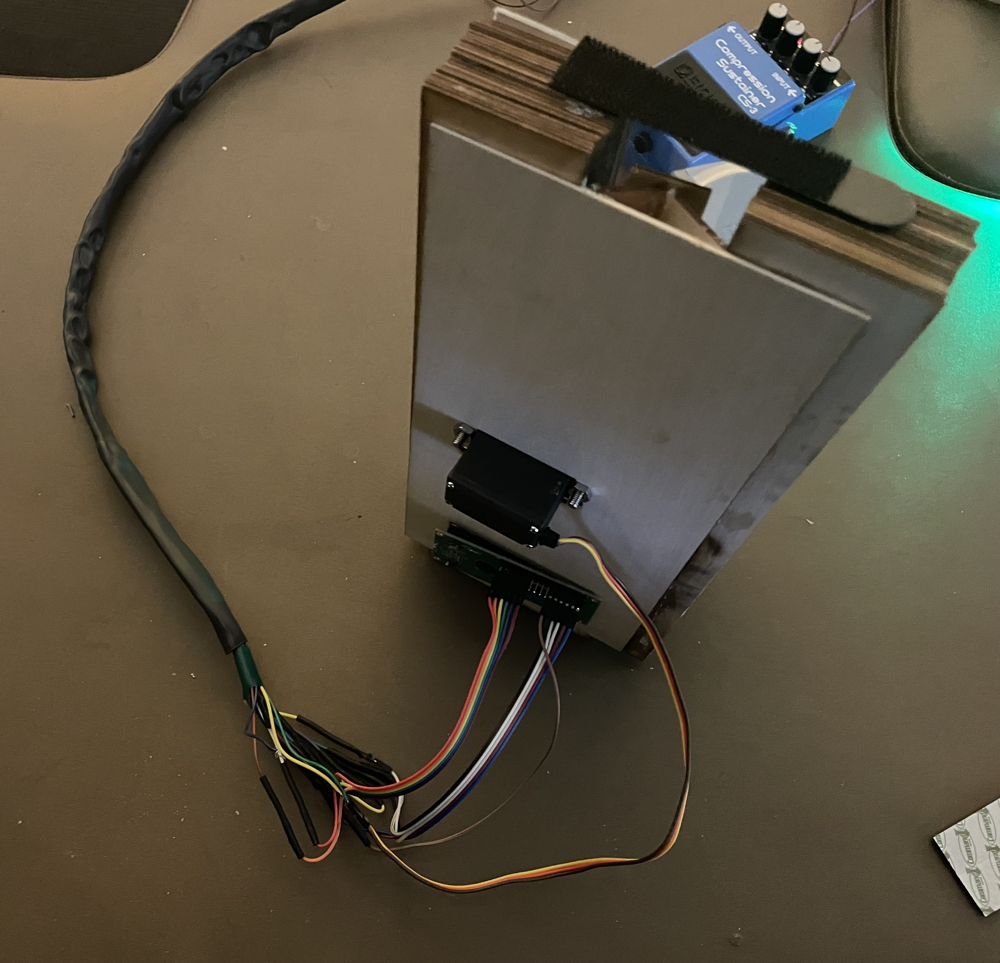
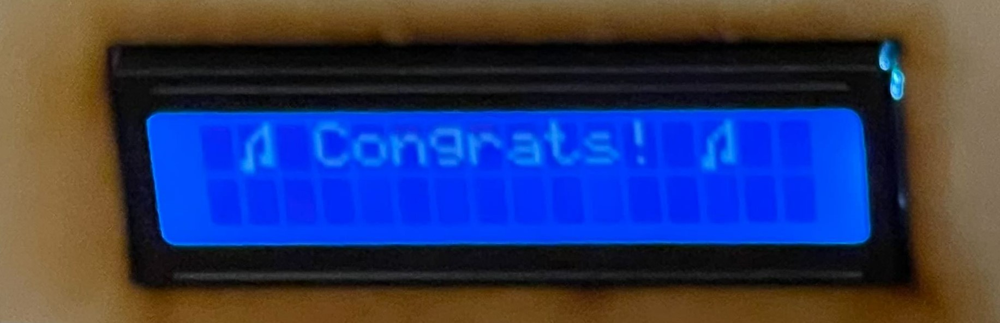
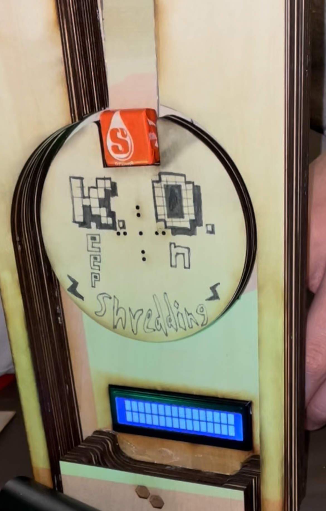

# Practice Pedal :zap::guitar:

The Practice Pedal project was completed during **HackGT9 Retro Reset** and won the **Best Hardware Hack 🛠️ Award**! Check out our \~[Devpost](https://devpost.com/software/practice-pedals)\~ for videos and more!

This project focuses on repurposing old guitar pedals into gamified devices to motivate kids to practice and get passionate about playing the electric guitar. 

1. We've done this by reading a voltage generated from the electric guitar into our pedal using signal processing (with an op-amp and full-wave rectifier that we wired to simplify playtime tracking), and using that data to track how long a player has been actively using the guitar while connected into our pedal with a connected Arduino Nano. 
3. This Arduino Nano then communicates via a custom heat-shrinked cable, which also has internally heat-shrinked connections to protect all solder connections, to a dispensing device that we built w/ layered laser-cut pieces and plexiglass. 
4. The dispenser device can be loaded up with starbursts, and each time a player hits a milestone, it has a central servo motor that is activated, dropping a single starbust through our mechanism. The dispenser device also has an LCD display, which we use to show time-elapsed playing and the goal time. This LCD also displays a "Congrats!" screen upon hitting the milestone, along with a custom music note character that we programmed in. 

## Images

#### Repurposed Vintage Guitar Pedal

#### Dispenser (Front-View)

#### Dispenser (Back-View)

#### LCD Display "Victory Screen"

#### Dispenser (Intermediate Prototype)

